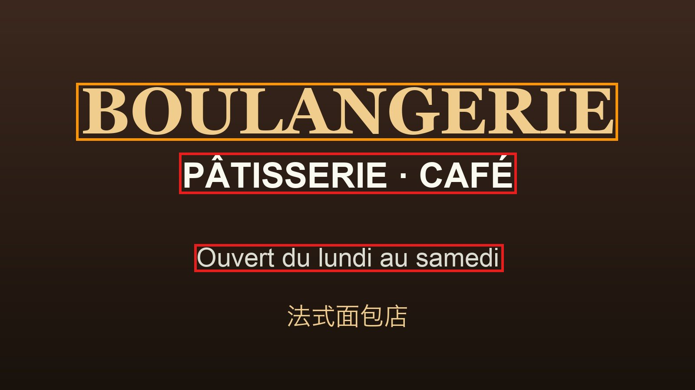

# 小语种检查

把图片或文件拖进网页，自动识别里面的文字；只要出现**中、英、日、韩以外**的文字
（法语、德语、俄语、泰语、阿拉伯语、越南语……），就标为“小语种”，一键整理到
`小语种/` 文件夹并附上备注（语种 + 识别到的原文）。

全部在本机运行，不上传任何文件。运行环境（Python 3.9 + 依赖 + 模型）已打包在文件夹内，
Apple 芯片的 Mac 解压即用。


## 下载使用

1. 到 [Releases](https://github.com/tianfeng66/minor-language-checker/releases/latest) 下载
   `minor-language-checker-*-macos.zip`（约 94 MB），解压。
2. 双击文件夹里的 `启动小语种检查.command`，浏览器会自动打开页面。启动文件要和 `engine/`、`runtime/`
   等放在一起，不要单独拖出来；想放桌面请右键“制作替身”。
3. 把图片、文件夹、zip、PDF、Word、txt 拖进页面，识别完点“导出”。

第一次打开如果提示“无法验证开发者”：打开 **系统设置 → 隐私与安全性**，拉到最下面点
**仍要打开**；或在终端输入 `bash `（带空格）后把启动文件拖进去回车。只需一次。

| 环境 | 说明 |
|---|---|
| Apple 芯片 Mac | 解压即用，无需安装任何东西、无需联网 |
| Intel Mac | 首次启动自动下载依赖（需联网，1~3 分钟） |
| 系统版本 | macOS 13 (Ventura) 及以上 |

面向使用者的完整说明见包内 [`使用说明.txt`](使用说明.txt)；`示例图片/` 里有 8 个示例可以直接拖进去试。

## 功能

- 支持图片（jpg / png / webp / heic / bmp / gif / tiff）、PDF、Word (docx)、txt / csv / srt 等文本、zip 压缩包、整个文件夹
- **放大搜索小字**：先识别全图，再按 2×2、3×3、5×5 切块放大重识别，街牌、角标、包装上的小字也能找到；确定命中后提前停止，省时间
- **两级判定**：确定 / 疑似，疑似单独放进 `疑似待复核/`；灵敏度可选宽松 / 标准 / 严格
- 识别结果可人工修正（标为小语种 / 非小语种），点开大图用红框 / 橙框标出命中的文字
- 读不了的文件（损坏、截断、0 字节、伪装扩展名、超时）自动跳过，单独列出原因
- **导出**：
  - 文件名加【法语】这类前缀
  - `小语种/备注.csv`：语种、原文、备注，Excel 可直接打开
  - 备注写入访达注释（⌘I 可见）
  - `标注预览/`：红框标出外语文字
  - `检查报告.csv` 与 `无法读取的文件.txt`
- 复制或移动原文件（移动仅限“本机路径”方式添加的文件）

<p>


</p>

## 识别流程

```
图片 ──► Apple Vision OCR（全图 → 2×2 → 3×3 → 5×5 放大，去重合并）
            │
            ▼ 每行文字
      ┌─ 非拉丁文字（西里尔、阿拉伯、泰文、天城文…）─► 按文字系统判定，细分俄/乌/白俄/塞/马其顿、阿拉伯/波斯/乌尔都
      └─ 拉丁字母 ─► lingua + fastText 投票 ＋ 外语词表 ＋ 变音字母 ＋ 功能词 ─► 语种与置信度
            │
            ▼
      整图汇总：零散语种合并、英文 / 拼音排除、确定 / 疑似分级 ─► 备注
```

**OCR**：`engine/lang_ocr.swift` 调用 macOS 自带的 Vision `VNRecognizeTextRequest`
（accurate 模式、自动语言），常驻进程 + JSON 行协议，多个进程并行。切块时相邻块重叠 18%、
放大到长边 1800px，避免文字被切断或太小。

**拉丁字母语种判断**是难点：法语、德语里大量单词和英文相同（RESTAURANT、HOTEL、BOULEVARD），
OCR 还会把中文拼音、英文 UI 误识别成“外语”。这里叠加了几层证据：

- **双模型投票**：[lingua](https://github.com/pemistahl/lingua-py)（限定 38 种拉丁字母语言）与 fastText `lid.176` 取平均
- **外语词表**：用 [wordfreq](https://github.com/rspeer/wordfreq) 统计每种语言前 5000 高频词，只收录“在该语言中的词频比英语高出 1 个 zipf 以上”的词，按差值分三档权重；比较时同时考虑去掉变音符后的英文词频（避免 `för`→`for` 这类撞车）
- **变音字母**（é ü ñ ø ł ő ş …）、法意语省音（`l'`、`d'`）、各语言功能词
- **拼音保护**：按标准拼音音节表切分，能完整切成拼音的词不算外语
- **排除英文**：模型判为英文且没有变音字母 / 强外语词 / 功能词时直接视为英文
- 德语复合词拆分、`oe/ue/ae` 与 `V→U`（古典刻字）等变体

**非拉丁文字**：西里尔 / 希腊字母里有很多和拉丁字母长得一样（А В С Е Н К М О Р Т Х），
只有出现足够多“不像拉丁字母”的字符才算数；低置信度、字母种类过少（OCR 幻觉的典型特征）会降级为疑似。

**文本文件**（txt / docx）没有 OCR 误差，走同一套判定，但跳过针对 OCR 幻觉的降级规则。

在 47 张真实小语种参考图上：标准灵敏度 + 精细级别确定 29、疑似 15，再用“极致重扫”后共检出 46 张；
58 张反例（英文 App 截图、中文游戏界面）中 40 张干净、17 张疑似、1 张误判为确定。

## 已知限制

- Vision OCR 不支持希腊文、印地文、希伯来文等少数文字：这类图片通常仍会被标为“疑似”，但语种名称可能不准
- 只由“英法通用词”组成的法语招牌（如 BOURSE / BOULEVARD / RESTAURANT）会按英文处理
- 仅支持 macOS（依赖 Vision 框架）

## 文件说明

| 文件 | 作用 |
|---|---|
| `启动小语种检查.command` | 双击启动：解除下载隔离、检查系统与引擎、准备依赖、启动服务并打开浏览器 |
| `使用说明.txt` | 面向使用者的完整说明 |
| `ui/` | 网页界面（拖放、进度、卡片、大图标注、导出） |
| `engine/server.py` | 本地 HTTP 服务：上传 / 扫描路径 / 识别调度 / 导出 / 预览 |
| `engine/lang_ocr.swift` | Vision OCR 命令行工具（切块放大、去重、常驻模式） |
| `engine/decide.py` | 整图汇总判定：确定 / 疑似、语种合并、备注 |
| `engine/classifier.py` | lingua + fastText 投票、拉丁字母证据、文字系统阈值 |
| `engine/textfeat.py` | 文字系统、变音字母、功能词、词表查询、拼音保护 |
| `engine/lexicon.json` | 外语词表（由 `tools/build_lexicon.py` 生成） |
| `engine/pinyin_syl.txt` | 标准拼音音节表 |
| `engine/setup_env.py` | 启动自检：依赖缺失时自动安装到 `pylib_<Python版本-架构>/` |
| `engine/paths.py` | 按 Python 版本与芯片选择依赖目录 |
| `示例图片/` | 8 个示例（由 `tools/make_demo.py` 生成） |
| `tools/setup_dev.sh` | 从源码准备完整运行环境 |
| `tools/make_package.sh` | 生成分享用 zip |

## 从源码运行 / 打包

```bash
git clone https://github.com/tianfeng66/minor-language-checker.git
cd minor-language-checker

# 准备与分享包一致的环境：独立 Python 3.9、pylib 依赖、fastText 模型、通用版识别引擎
# 需要 Apple 芯片 Mac + Xcode 命令行工具（xcode-select --install）
bash tools/setup_dev.sh

# 运行
./启动小语种检查.command

# 生成分享包 dist/小语种检查.zip
bash tools/make_package.sh
```

不跑 `setup_dev.sh` 直接双击启动也可以：会改用系统里的 Python，并自动把依赖装到
`pylib_<版本-架构>/`、下载模型、编译识别引擎（需要 Xcode 命令行工具）。

## 第三方组件

| 组件 | 用途 | 许可 |
|---|---|---|
| Apple Vision / NaturalLanguage | 文字识别 | macOS 系统框架 |
| [lingua-py](https://github.com/pemistahl/lingua-py) | 语种识别 | Apache-2.0 |
| [fastText](https://github.com/facebookresearch/fastText) + [lid.176.ftz](https://fasttext.cc/docs/en/language-identification.html) | 语种识别 | MIT / 模型 CC BY-SA 3.0 |
| [wordfreq](https://github.com/rspeer/wordfreq) | 生成外语词表（`lexicon.json` 为其衍生数据） | Apache-2.0 / 数据 CC BY-SA 4.0 |
| [regex](https://github.com/mrabarnett/mrab-regex) | Unicode 文字系统匹配 | Apache-2.0 |
| [Pillow](https://github.com/python-pillow/Pillow) | 标注预览图 | MIT-CMU |
| [python-build-standalone](https://github.com/astral-sh/python-build-standalone) | 随包 Python 3.9 | PSF 等 |
